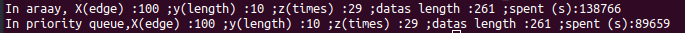

# Small World  
  
## Project Introduction  
  
A small-world network is a type of mathematical graph in which most nodes are not neighbors of one another,  
but the neighbors of any given node are likely to be neighbors of each other and most nodes can be reached   
from every other node by a small number of hops or steps.  
  
## Class and file connection  
  
  
  
## Result of the .exe  
  
  
  
Generate All point and draw edge  

  
  
Dijstra Result Array vs Priorty Queue  

## Author  
  
吳昀倫  
  
## Algorithm source  
  
http://web.ntnu.edu.tw/~algo/Path.html  

